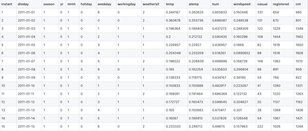
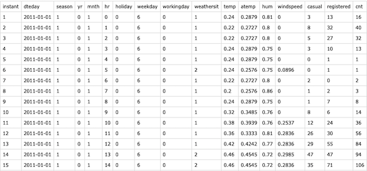

# Bike Sharing Prediction

This project is derived from Udacity's Deep learning course. We use a neural network to predict daily bike rental ridership.

We have two data files:
- day.csv
- hour.csv

<br>

Lets have a look at them!<br>
• 15 tuples of day.csv

<br>

• 15 tuples of hour.csv

#### Neural Network

```python
def __init__(self, input_nodes, hidden_nodes, output_nodes, learning_rate):

        # Set number of nodes in input, hidden and output layers.
        self.input_nodes = input_nodes
        self.hidden_nodes = hidden_nodes
        self.output_nodes = output_nodes

        # Initialize weights
        self.weights_input_to_hidden = np.random.normal(0.0, self.input_nodes**-0.5, 
                                       (self.input_nodes, self.hidden_nodes))

        self.weights_hidden_to_output = np.random.normal(0.0, self.hidden_nodes**-0.5, 
                                       (self.hidden_nodes, self.output_nodes))
        self.lr = learning_rate
        self.activation_function = lambda x : 1/(1+np.exp(-x))
    
```